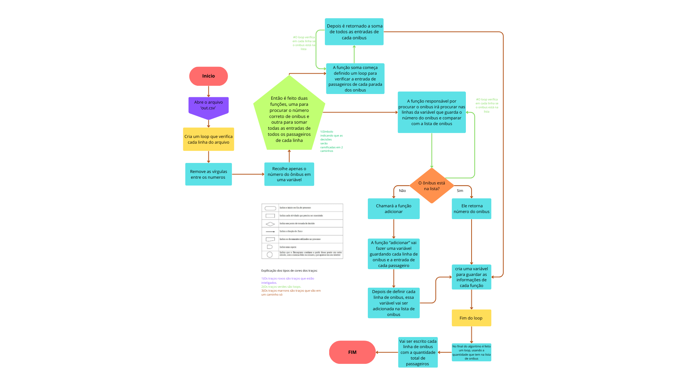

# Situação de Aprendizagem

1. Introdução

Este projeto contém um algoritmo desenvolvido por meio da linguagem de programação Python para a análise e priorização de linhas de transporte público tendo como base o fluxo de passageiros. O objetivo é fornecer uma ferramenta que auxilie a prefeitura e a empresa responsável pela gestão do transporte público a identificar quais linhas estão sobrecarregadas e necessitam de investimento e os trajetos com pouca demanda.

2. Propósito

O algoritmo se faz necessário como um meio de analisar a qualidade dos serviços oferecidos e também como uma ferramenta de prevenção visto que a prefeitura irá investir um valor considerável para realizar as melhorias nas linhas de ônibus. Por meio do algoritmo, a prefeitura, em conjunto com a empresa de ônibus, conseguirá, de forma precisa, verificar quais são as linhas que estão mais congestionadas em certos horários e também quais não contam com um grande número de passageiros, dessa forma será possível realocar alguns automóveis para desafogar outras linhas. Com essa análise, eles terão maior segurança para realizar os investimentos, já que irão se basear em dados reais, evitando retrabalho e mais gastos. Isso garante uma otimização de recursos públicos, garantindo que o investimento seja feito no lugar certo para máximo retorno.

Além dos retornos significativos mencionados, é importante frisar que o algoritmo apresentado neste projeto irá beneficiar também os usuários do transporte público de forma direta, já que as melhorias irão reduzir o tempo de espera, proporcionar viagens mais confortáveis e menos lotadas.

Funcionalidades

O algoritmo, que foi desenvolvido em Python por meio do VS Code, lê um arquivo CSV, intitulado de out.csv, que contém os dados sobre o fluxo de passageiros. Cada linha do arquivo representa uma linha de ônibus, seguida pelo número de passageiros que embarcaram em cada parada. O script faz o seguinte:

Realiza a leitura de dados: Abre e processa o arquivo out.csv linha por linha.
Identifica as linhas: Para cada linha de ônibus, o algoritmo irá localizar ou criar um registro para ela.
Soma os passageiros: Calcula o total de passageiros para cada linha de ônibus.
Exibe o resultado: Imprime no terminal um resumo do total de passageiros por linha, destacando as que possuem maior volume.

3. Como Usar

Para executar o algoritmo, siga estes passos:

 Pré-requisito: Certifique-se de que o arquivo out.csv esteja na mesma pasta que o script. 

Este arquivo deve seguir o formato: 

linha_do_onibus,passageiros_parada_1:sentido_1,passageiros_parada_2:sentido_2,...

 Execute o script Python:
       Busões.py
    

O resultado será exibido diretamente no terminal, mostrando o número total de passageiros por viagem para cada linha de ônibus.

4. Créditos

Este projeto foi desenvolvido por Jailine Coelho Santos, Juliana Laura Silva Leite e Julio Da Cruz Neto.

